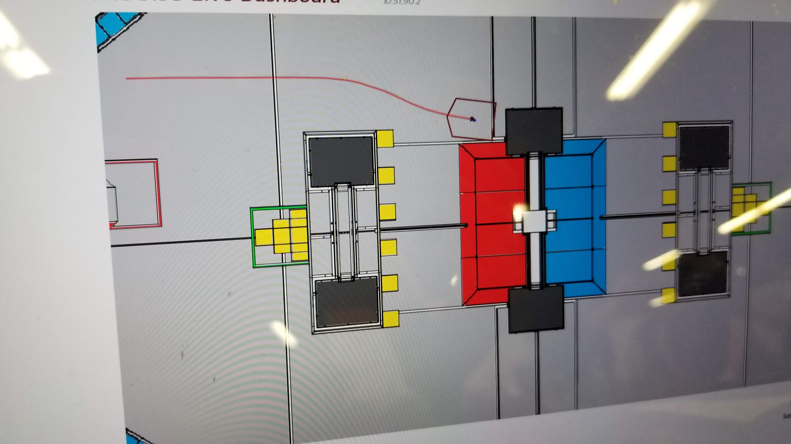

# LiveDashboard



This is a dashboard to test common path following algorithms such as Ramsete. To use this in your code, use the "Live Dashboard" table in NT.

```kotlin
val instance = NetworkTableInstance.getDefault().getTable("Live Dashboard")
```

To add the robot's pose to the dashboard, use the following properties:
* Robot X
* Robot Y
* Robot Heading

Remember that robot heading must be in radians.

```kotlin
instance.getEntry("Robot X").setDouble(123)
```

Your path variables should also be provided through the "Path X" and "Path Y" properties.

Make sure you change the IP from 10.51.90.2 in `livedashboard.py` to the IP address of your robot. If there are errors, make sure you install all dependencies through `pip`.

To run the dashboard, run `python livedashboard.py` in a terminal window.

